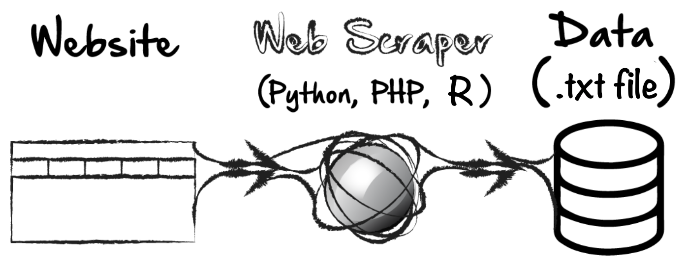

class: center, middle, inverse, title-slide

## R tutorial: data scraping
#### Jeremy Mack
#### Lehigh University - Digital Scholarship Team
<center></center>
<br/><br/>

---
### About this tutorial

 * This tutorial will focus on **data scraping** using R.
 
--
 
 * It uses an example of extracting COVID-19 data from the daily report issued by the PA Department of Health.
 
---
class: center, middle, inverse

#### First, what is data scraping?
<br/><br/>
<br/><br/>
<br/><br/>
<br/><br/>
<br/><br/>
<br/><br/>

---
#### Data scraping

<center></center>

 * **Data scraping** is a technique in which a computer program extracts data from human-readable output coming from another program.
 
--

 * One form of data scraping is referred to as **web scraping**.

---
#### Data scraping

<center></center>

 * **Data scraping** is a technique in which a computer program extracts data from human-readable output coming from another program.

 * One form of data scraping is referred to as **web scraping**.
 
 * Web scraping uses tools to extract data from a web page by accessing its **text-based mark-up language** (i.e., HTML and XHTML).
 
--
 
 * In other words, we are taking existing **HTML data**, using a web scraper (**R**) to identify the data, and convert it into a useful format (**.txt file**).

---
class: center, middle, inverse

#### Data scraping in R
<br/><br/>
<br/><br/>
<br/><br/>
<br/><br/>
<br/><br/>
<br/><br/>

---
#### Data scraping in R

.pull-right2[
<center></center>]

.pull-left2[
Data scraping in R can be broken down into three basic steps:
{{content}}]

--

 1. Identify website XPath
 {{content}}
 
--

 2. Extract data using **rvest** package
 {{content}}
 
--
 
 3. Create and export data frame
 {{content}}

---
class: center, middle, inverse

#### Step 1: Data scraping in R
<br/><br/>
<br/><br/>
<br/><br/>
<br/><br/>
<br/><br/>
<br/><br/>

---
#### Step 1: Identify website XPath

<center></center>

 * R uses an **XPath** to locate elements on a web page.
 
--
 
 * XPath, short for XML path, uses an **XML path expression** to locate items.
 
--

 * We could write our own XPath, but instead, we'll use a browser window, to identify the exact XPath we're interested in.

---
#### Step 1: Identify website XPath

.pull-right2[
<center></center>
<br/><br/>
<center></center>

]

.pull-left2[Basic steps to identify an XPath:
 
 1. Open web page in Google Chrome.
  
 2. Right click on the item you're interested in scraping and click **Inspect**.
  
 3. In the **Elements portion Inspector window**, mouse over each line until the entire talbe is highlighted.
  
 4. Right click on the line, click **Copy**, and then click **Copy XPath**
  ]

---
#### Step 1: Identify website XPath

<iframe width="750" height="500" src="https://www.youtube.com/embed/KAqxWsE29_c?VQ=HD1080" frameborder="0" allow="accelerometer; autoplay; encrypted-media; gyroscope; picture-in-picture" allowfullscreen></iframe>

---
class: center, middle, inverse

#### Step 2: Extract data using *rvest* package
<br/><br/>
<br/><br/>
<br/><br/>
<br/><br/>
<br/><br/>
<br/><br/>

---
#### Step 2: Extract data using *rvest* package

.tiny[
* Load necessary packages
```{r warning=FALSE, message=FALSE}
library(tidyverse) # Load core Tidyverse packages, includeing dplyr
library(rvest)     # Additional Tidyverse packages for web scraping
library(xml2)      # Package to work with XML files

```

* Set urls for PA Deparment of Health web pages (cases and deaths)
```{r warning=FALSE, message=FALSE}
url1 <- "https://www.health.pa.gov/topics/disease/coronavirus/Pages/Cases.aspx"
url2 <- "https://www.health.pa.gov/topics/disease/coronavirus/Pages/Death-Data.aspx"
```

* Set XPaths to the tables that were copied from each web page
```{r warning=FALSE, message=FALSE}
xpath1 <- '//*[@id="ctl00_PlaceHolderMain_PageContent__ControlWrapper_RichHtmlField"]/table[5]'
xpath2 <- '//*[@id="ctl00_PlaceHolderMain_PageContent__ControlWrapper_RichHtmlField"]/table'
```
]

---
#### Step 2: Extract data using *rvest* package

.tiny[
* Scrape and create data frame for COVID-19 case data
```{r warning=FALSE, message=FALSE}
cases <- url1 %>%                # Scrape data
  read_html() %>%
  html_nodes(xpath=xpath1) %>%
  html_table()
cases <- cases[[1]]              # Select table number
cases <- cases[-1,]              # Remove first row, which contains table headers
cases <- cases[,c(1:2)]          # Select column for County and Cases
names(cases) <- c("County",
                  "Covid_cases") # Add column names

head(cases, 5)
```
]

---
#### Step 2: Extract data using *rvest* package

.tiny[
* Scrape and create data frame for COVID-19 death data
```{r warning=FALSE, message=FALSE}
deaths <- url2 %>%                 # Scrape data
  read_html() %>%
  html_nodes(xpath=xpath2) %>%
  html_table()
deaths<- deaths[[1]]               # Select table number
deaths<- deaths[-1,]               # Remove first row, which contains table headers
deaths <- deaths[,c(1:2)]          # Select column for County and Deaths
names(deaths) <- c("County",
                   "Covid_deaths") # Add column names
deaths[35,1] <- "McKean"           # Fix name for McKean County (not Mckean)

head(deaths, 5)
```
]

---
class: center, middle, inverse

#### Step 3: Create and export data frame
<br/><br/>
<br/><br/>
<br/><br/>
<br/><br/>
<br/><br/>
<br/><br/>

---
#### Step 3: Create and export data frame

.tiny[
* Merge both data frames
```{r warning=FALSE, message=FALSE}
df <- merge(cases, deaths, by="County", all.x=TRUE) # Merge by County

df <- df %>%                                        # Set data structure for variables
  mutate(County=as.factor(County),
         Covid_cases=as.numeric(Covid_cases),
         Covid_deaths=as.numeric(gsub(",","",Covid_deaths))) %>%
  mutate(Covid_deaths=ifelse(is.na(Covid_deaths),0,Covid_deaths))

head(df, 5)
```
]

---
#### Step 3: Create and export data frame

.tiny[
* Export to text file
```{r eval=FALSE}
write.table(df,
            "/Users/jeremymack/Desktop/COVID19_data.txt",
            sep=",",
            row.names=FALSE)
```

* Note, you'll need to change *"/Users/jeremymack/Desktop/"* in the above filepath, to your own working directory.
]
