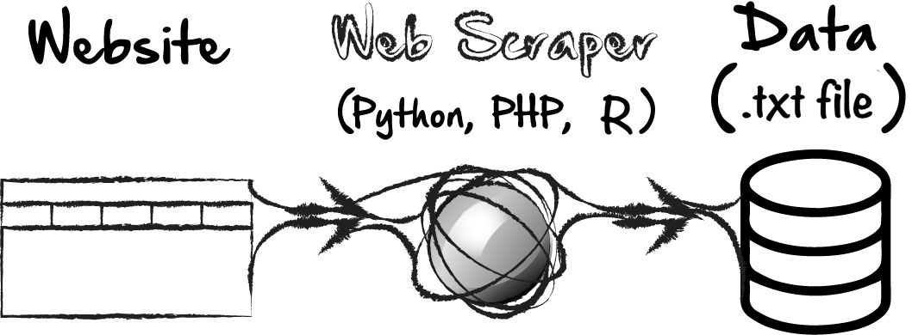
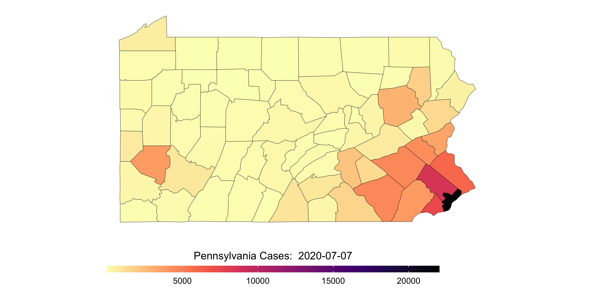
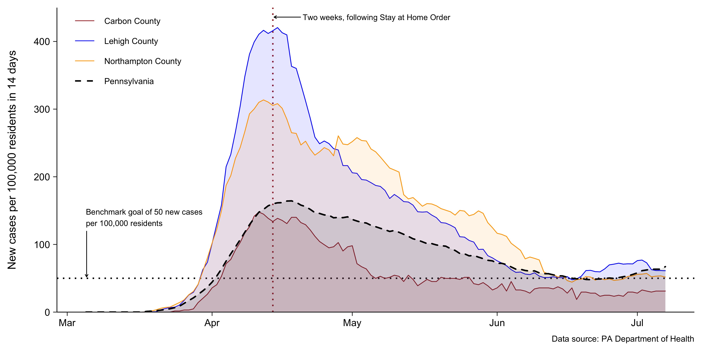

class: center, middle, inverse, title-slide

## R tutorial: data scraping
#### Jeremy Mack
#### Lehigh University - Digital Scholarship Team
<br/>
<center></center>
<br/><br/><br/>

---
### About this tutorial

 * This tutorial will focus on **data scraping** using R.
 
--
 
 * It uses an example of extracting COVID-19 data from daily reports issued by the [PA Department of Health](https://www.health.pa.gov/topics/disease/coronavirus/Pages/Coronavirus.aspx).

--

 * Slides from an intro course on **Programming in R**,
 can be found on [Github](https://jeremymack-lu.github.io/rprog/).
 
---
class: center, middle, inverse

#### First, what is data scraping?
<br/><br/>
<br/><br/>
<br/><br/>
<br/><br/>
<br/><br/>
<br/><br/>

---
#### What is data scraping?

<center></center>

 * **Data scraping** is a technique in which a computer program extracts data from human-readable output coming from another program.
 
--

 * Two forms of data scraping include **web scraping** and **document scraping**.

---
#### What is data scraping?

<center></center>

 * **Data scraping** is a technique in which a computer program extracts data from human-readable output coming from another program.

 * Two forms of data scraping include **web scraping** and **document scraping**.
 
  1. Web scraping uses tools to extract data from a web page by accessing its **text-based mark-up language** (i.e., HTML and XHTML).
 
--

  2. Document scraping uses tools to extract data from a document file, often one thats **format is less accessible** (i.e., PDF).
 
--
 
 * In this tutorial, we'll extract data from both an **HTML and PDF source**, using a data scraper (**R**), and convert it into a useful format (**.txt file**).
 
---
class: center, middle, inverse

#### Data scraping using R
<br/><br/>
<br/><br/>
<br/><br/>
<br/><br/>
<br/><br/>
<br/><br/>

---
#### Data scraping using R

.pull-right2[
<center> </center>
<center></center>
<center> </center>
]

.pull-left2[
Data scraping using R can be broken down into three basic steps:
{{content}}]

--

 1. Identify data source
 
  + Web scraping - XPath
  
  + Document scraping - file location
 {{content}}
 
--

 2. Extract data in R
 {{content}}
 
--
 
 3. Create and export data frame in R
 {{content}}
 
--

Most of the programming in R will utilize a collection of packages and functions known as the [tidyverse](https://www.tidyverse.org).

---
class: center, middle, inverse

#### Data scraping using R
Example 1 - Web scraping
<br/><br/>
<br/><br/>
<br/><br/>
<br/><br/>
<br/><br/>

---
#### Example 1 - Web scraping

.pull-right2[
<center> </center>
<center></center>]

.pull-left2[
Basic steps:
 1. Identify data source
 
  + Web scraping - XPath

 2. Extract data in R - **revest**
 
 3. Create and export data frame in R - **dplyr**
]

---
class: center, middle, inverse

#### Step 1: Identify data source
<br/><br/>
<br/><br/>
<br/><br/>
<br/><br/>
<br/><br/>
<br/><br/>

---
#### Step 1: Identify data source

<center></center>

 * R uses an **XPath** to locate elements on a web page.
 
--
 
 * XPath, short for XML path, uses an **XML path expression** to locate items.
 
--

 * We could write our own XPath, but instead, we'll use a browser window, to identify the exact XPath we're interested in.

---
#### Step 1: Identify data source

.pull-right4[
<center></center>
<br/>
<center></center>
]

.pull-left4[
Basic steps (video on next slide):

  1. Open web page in Google Chrome, or Safari.
  {{content}}
]

--

  2. Right click on the item you're interested in scraping and click **Inspect**.
  {{content}}
  
--

  3. In the **Elements portion of the Inspector window**, mouse over each line until the entire table is highlighted.
  {{content}}
  
--

  4. Right click on the line, click **Copy**, and then click **Copy XPath**.

---
#### Step 1: Identify data source

<iframe width="750" height="500" src="https://www.youtube.com/embed/KAqxWsE29_c?VQ=HD1080" frameborder="0" allow="accelerometer; autoplay; encrypted-media; gyroscope; picture-in-picture" allowfullscreen></iframe>

---
class: center, middle, inverse

#### Step 2: Extract data in R
<br/><br/>
<br/><br/>
<br/><br/>
<br/><br/>
<br/><br/>
<br/><br/>

---
#### Step 2: Extract data in R

.tiny[
* Load necessary packages
```{r warning=FALSE, message=FALSE}
library(tidyverse) # Load core Tidyverse packages, including dplyr
library(rvest)     # Additional Tidyverse packages for web scraping
library(xml2)      # Package to work with XML files
```
]

--

.tiny[
* Set urls for PA Department of Health web pages (cases and deaths)
```{r warning=FALSE, message=FALSE}
url1 <- 'https://www.health.pa.gov/topics/disease/coronavirus/Pages/Archives.aspx'
url2 <- 'https://www.health.pa.gov/topics/disease/coronavirus/Pages/Death-Data.aspx'
```
]

--

.tiny[
* Set XPath for web page table(s)
```{r warning=FALSE, message=FALSE}
xpath <- '//*[@id="ctl00_PlaceHolderMain_PageContent__ControlWrapper_RichHtmlField"]/table'
```
]

---
#### Step 2: Extract data in R
.tiny[
* Scrape and create data frame for COVID-19 case data
```{r warning=FALSE, message=FALSE}
cases <- url1 %>%                # Scrape data
  read_html() %>%
  html_nodes(xpath=xpath) %>%
  html_table()
cases <- cases[[8]]              # Select table number
cases <- cases[-1,]              # Remove first row, which contains table headers
cases <- cases[,c(1:2)]          # Select column for County and Cases
names(cases) <- c("County",
                  "Cases")       # Add column names

head(cases, 10)                  # View first five rows of data frame
```
]

---
#### Step 2: Extract data in R

.tiny[
* Scrape and create data frame for COVID-19 death data
```{r warning=FALSE, message=FALSE}
deaths <- url2 %>%                 # Scrape data
  read_html() %>%
  html_nodes(xpath=xpath) %>%
  html_table()
deaths <- deaths[[1]]              # Select table number
deaths <- deaths[-1,]              # Remove first row, which contains table headers
deaths <- deaths[,c(1:2)]          # Select column for County and Deaths
names(deaths) <- c("County",
                   "Deaths")       # Add column names
deaths[35,1] <- "McKean"           # Fix name for McKean County (not Mckean)

head(deaths, 10)                   # View first 10 rows of data frame
```
]

---
class: center, middle, inverse

#### Step 3: Create and export data frame in R
<br/><br/>
<br/><br/>
<br/><br/>
<br/><br/>
<br/><br/>
<br/><br/>

---
#### Step 3: Create and export data frame in R

.tiny[
* Merge both data frames and add today's date
```{r warning=FALSE, message=FALSE}
df <- merge(cases, deaths, by="County", all.x=TRUE)    # Merge by County

df <- df %>%                                           # Set data structure for variables
  mutate(County=as.factor(County),                     # Set County to factor
         Cases=as.numeric(Cases),                      # Set Cases to numeric
         Deaths=as.numeric(gsub(",","", Deaths))) %>%  # Set Deaths to numeric
  mutate(Deaths=ifelse(is.na(Deaths),0, Deaths))       # Change NAs to 0

head(df, 10)                                           # View first 10 rows of data frame
```

]

---
#### Step 3: Create and export data frame in R

.tiny[
 * Export to text file
```{r eval=FALSE}
write.table(df,
            "/Users/jeremymack/Desktop/COVID19_data.txt",
            sep=",",
            row.names=FALSE)
```

 * Note, you'll need to change <font size="3" color="red">"/Users/jeremymack/Desktop/"</font> in the above filepath, to your own working directory.

]

---
class: center, middle, inverse

#### Data scraping using R
Example 2 - Document scraping
<br/><br/>
<br/><br/>
<br/><br/>
<br/><br/>
<br/><br/>

---
#### Example 2 - Document scraping

<center></center>

 * On June 7, PA Department of Health changed their method of reporting data.
 
--
 
 * Reporting moved from an HTML-based table to a PDF document.
 
--
 
 * Data scraping methods are (**and need to be**) flexible!

---
#### Example 2 - Document scraping

.pull-right2[
<center> </center>
<center></center>
<center> </center>]

.pull-left2[
Basic steps:
 1. Identify data source
 
  + Document scraping - file location

 2. Extract data in R - **rvest**, **stringr**, **readr**
 
 3. Create and export data frame in R - **dplyr**
]

---
class: center, middle, inverse

#### Step 1: Identify data source
<br/><br/>
<br/><br/>
<br/><br/>
<br/><br/>
<br/><br/>
<br/><br/>

---
#### Step 1: Identify data source

.tiny[
* Load necessary packages
```{r warning=FALSE, message=FALSE}
library(tidyverse) # Load core Tidyverse packages, including dplyr
library(rvest)     # Additional Tidyverse package for web scraping
library(readr)     # Additional Tidyverse package for reading table data
library(pdftools)  # Package to work with PDF files
```
]

--

.tiny[
* Set url for PA Department of Health web page
```{r warning=FALSE, message=FALSE}
page <- read_html("https://www.health.pa.gov/topics/disease/coronavirus/Pages/Cases.aspx")
```
]

--

.tiny[
* Identify PDF links on page and set urls for data tables (cases and deaths)
```{r eval=FALSE, warning=FALSE, message=FALSE}
raw_list <- page %>%      # Use url set as "page"
  html_nodes("a") %>%     # Identify attributes on the page w/ css selector "a"
  html_attr("href") %>%   # Identify "href" attributes (i.e., link destination)
  str_subset("\\.pdf")    # Subset "href" attributes that end in .pdf
raw_list
```
]

.tiny2[
```{r echo=FALSE, warning=FALSE, message=FALSE, comment=NA}
raw_list <- page %>%
  html_nodes("a") %>%
  html_attr("href") %>%
  str_subset("\\.pdf")
raw_list[1:2]
```
]

.tiny[
```{r warning=FALSE, message=FALSE}
url1 <- paste("https://www.health.pa.gov", raw_list[1], sep="")
url2 <- paste("https://www.health.pa.gov", raw_list[2], sep="")
```
]

---
class: center, middle, inverse

#### Step 2: Extract data in R
<br/><br/>
<br/><br/>
<br/><br/>
<br/><br/>
<br/><br/>
<br/><br/>

---
#### Step 2: Extract data in R
.tiny[
* Scrape and create data frame for COVID-19 case data
```{r warning=FALSE, message=FALSE}
pdf1 <- pdf_text(url1) %>%  # Select the linked PDF with case data
  read_lines()              # Read lines into a list of vectors

cases <- pdf1 %>%             # Select the list of vectors
  str_squish() %>%          # Remove extra whitespace between elements
  str_split(pattern=" ")    # Split vector string into pieces (i.e., columns)

cases <- do.call(rbind,
               Filter(function(x) length(x)==6, cases))  # Combine list elements with 6 items

cases <- cases %>%
  as.data.frame() %>%                         # Convert to a data frame
  mutate(County=as.factor(V1),                # Set County to factor
         Cases=as.numeric(as.character(V3))) %>%            # Set Cases to numeric
  mutate(County=str_to_sentence(County)) %>%  # Change County from all caps
  select(7:8)

head(cases, 5)  # View first 5 rows of data frame
```
]

---
#### Step 2: Extract data in R
.tiny[
* Scrape and create data frame for COVID-19 death data
```{r warning=FALSE, message=FALSE}
pdf2 <- pdf_text(url2) %>%  # Select the linked PDF with case data
  read_lines()              # Read lines into a list of vectors

deaths <- pdf2 %>%             # Select the list of vectors
  str_squish() %>%          # Remove extra whitespace between elements
  str_split(pattern=" ")    # Split vector string into pieces (i.e., columns)

deaths <- do.call(rbind,
               Filter(function(x) length(x)==3, deaths))  # Combine list elements with 3 items

deaths <- deaths %>%
  as.data.frame() %>%                         # Convert to a data frame
  mutate(County=as.factor(V1),                # Set County to factor
         Deaths=as.numeric(V2)) %>%           # Set Cases to numeric
  select(4:5)

head(deaths, 5)  # View first 5 rows of data frame
```
]

---
class: center, middle, inverse

#### Step 3: Create and export data frame in R
<br/><br/>
<br/><br/>
<br/><br/>
<br/><br/>
<br/><br/>
<br/><br/>

---
#### Step 3: Create and export data frame in R

.tiny[
* Merge both data frames and add today's date
```{r warning=FALSE, message=FALSE}
df <- merge(cases, deaths, by="County", all.x=TRUE)    # Merge by County

df <- df %>%                                           # Set data structure for variables
  mutate(County=as.factor(County),                     # Set County to factor
         Cases=as.numeric(Cases),                      # Set Cases to numeric
         Deaths=as.numeric(gsub(",","", Deaths))) %>%  # Set Deaths to numeric
  mutate(Deaths=ifelse(is.na(Deaths),0, Deaths))       # Change NAs to 0

head(df, 10)                                           # View first 10 rows of data frame
```

]

---
#### Step 3: Create and export data frame in R

.tiny[
 * Export to text file
```{r eval=FALSE}
write.table(df,
            "/Users/jeremymack/Desktop/COVID19_data.txt",
            sep=",",
            row.names=FALSE)
```

 * Note, you'll need to change <font size="3" color="red">"/Users/jeremymack/Desktop/"</font> in the above filepath, to your own working directory.

]

---
class: center, middle, inverse
#### Data scraping using R

```{r include=FALSE}
library("maps")
library("viridis")

pa.county <- map_data("county") %>%
  filter(region=="pennsylvania")

pa.fips <- county.fips %>%
  separate(polyname, c("region", "subregion"), sep = ",") %>%
  filter(region=="pennsylvania")

pa.data <- left_join(pa.county, pa.fips, c("region", "subregion"))
pa.data <- pa.data %>%
  mutate(subregion=str_to_sentence(subregion)) %>%
  mutate(subregion=ifelse(subregion=="Mckean", "McKean", subregion))

cases <- cases %>%
  mutate(County=ifelse(County=="Mckean", "McKean", County))
names(cases)[1] <- "subregion"

pa.data <- left_join(pa.data, cases, "subregion") 

pa <- ggplot(pa.data) +
  geom_polygon(aes(long, lat, group=group, fill=Cases),
               color = "black", size = 0.1) + 
  ggthemes::theme_map() + 
  coord_map("mercator") +
  scale_fill_viridis(option="A",
                     discrete = F,
                     name = paste("Pennsylvania Cases: ", Sys.Date()),
                     direction = -1,
                     guide = guide_colourbar(
                       direction = "horizontal",
                       barheight = unit(2, units = "mm"),
                       barwidth = unit(100, units = "mm"),
                       draw.ulim = F,
                       title.position = 'top',
                       title.hjust = 0.5,
                       label.hjust = 0.5)) +
  theme(legend.position = "bottom")

jpeg(file="images/PA_county_cases.jpeg",
     width=7,height=3.5,
     units="in",
     res=600)
pa
dev.off()

```

```{r include=FALSE}
library(zoo)
df5 <- read.table("/Users/jeremymack/Documents/Lehigh/GIS/Projects/COVID19/covid19_daily_total_pa.csv",
                  sep=",",
                  header=TRUE)
df5 <- df5 %>% mutate(Date=as.Date(Date, format="%Y-%m-%d"))

df4 <- read.table("/Users/jeremymack/Documents/GitHub/covid19/covid19_pa_counties.csv",
                  sep=",",
                  header=TRUE)
df4 <- df4 %>% mutate(Date=as.Date(Date, format="%Y-%m-%d"))

lvc <- c("Lehigh","Carbon","Northampton")
lv <- df4 %>% 
  filter(County %in% lvc) %>%
  group_by(County) %>% 
  mutate(New=Cases-lag(Cases, default=0))


lv <- lv %>%
  group_by(County) %>%
  mutate(New14=rollapply(New,14,sum,fill=0,align="right"),
         Incidence14=ifelse(County=="Lehigh",
                            round(New14/(368100/100000),1),
                            ifelse(County=="Northampton",
                                   round(New14/(304807/100000),1),
                                   round(New14/(64227/100000),1))))

pa <- df5 %>%
  mutate(New14=zoo::rollapply(New,14,sum,fill=0,align="right"),
         Incidence14=New14/(12807060/100000))

lvi <- lv %>% select(County, Date, Incidence14) %>% as.data.frame()

pai <- pa %>% mutate(County="Pennsylvania") %>% select(County, Date, Incidence14)

Data <- lvi %>% add_row(County=pai$County,
                        Date=pai$Date,
                        Incidence14=pai$Incidence14)

plot <- ggplot(data=Data, aes(x=Date,
                              y=Incidence14,
                              color=County,
                              group=County,
                              fill=County,
                              size=County,
                              linetype=County)) +
  geom_hline(yintercept=50, linetype=3) +
  geom_vline(xintercept=as.Date("2020-04-14"), linetype=3, color="brown") +
  geom_line(position="identity") +
  geom_area(position="identity", alpha=0.1, show.legend=FALSE) +
  annotate(geom="segment",
           xend=as.Date("2020-04-14") + 0.25,
           x=as.Date("2020-04-20"),
           y=436,
           yend=436,
           size=0.25,
           arrow = arrow(length = unit(0.01, "npc"))) +
  annotate(geom="text", x=as.Date("2020-04-20") + 0.4, y=436, 
           label="Two weeks, following Stay at Home Order", 
           hjust=0, size=2) +
  annotate(geom="segment",
           x=as.Date("2020-03-05")+0.15,
           xend=as.Date("2020-03-05")+0.15,
           yend=52,
           y=120,
           size=0.25,
           arrow = arrow(length = unit(0.01, "npc"))) +
  annotate(geom="text", x=as.Date("2020-03-05"), y=140,
           label="Benchmark goal of 50 new cases\nper 100,000 residents",
           hjust=0, size=2) +
  scale_color_manual(values=c(Carbon="Brown",
                              Lehigh="Blue",
                              Northampton="Orange",
                              Pennsylvania="Black"),
                     labels=c("Carbon County",
                              "Lehigh County",
                              "Northampton County",
                              "Pennsylvania")) +
  scale_fill_manual(values=c(Carbon="Brown",
                             Lehigh="Blue",
                             Northampton="Orange",
                             Pennsylvania="Black"),
                    labels=c("Carbon County",
                             "Lehigh County",
                             "Northampton County",
                             "Pennsylvania")) +
  scale_size_manual(values=c(0.25,0.25,0.25,0.5),
                    labels=c("Carbon County",
                             "Lehigh County",
                             "Northampton County",
                             "Pennsylvania")) +
  scale_linetype_manual(values=c(1,1,1,2),
                        labels=c("Carbon County",
                                 "Lehigh County",
                                 "Northampton County",
                                 "Pennsylvania")) +
  labs(y="New cases per 100,000 residents in 14 days\n ",
       caption="Data source: PA Department of Health") +
  expand_limits(y=c(0,450)) +
  scale_y_continuous(expand=c(0,0)) +
  theme(panel.background=element_blank(),
        panel.grid=element_blank(),
        plot.title=element_text(size=9, color="black"),
        strip.background=element_rect(color="black", size=0.25),
        axis.line=element_line(size=0.25),
        axis.ticks=element_line(size=0.25),
        axis.text=element_text(size=7, color="black"),
        axis.title=element_text(size=8, color="black"),
        axis.title.x=element_blank(),
        plot.caption=element_text(size=6, color="black"),
        legend.justification="top",
        legend.title=element_blank(),
        legend.position=c(0.11,1.04),
        legend.text=element_text(size=6, color="black"),
        legend.key=element_blank(),
        legend.key.width=unit(1.2,"line"),
        legend.key.size = unit(1, 'lines'))

jpeg(file="images/PA_LV_cases.jpeg",
     width=7,height=3.5,
     units="in",
     res=600)
plot
dev.off()
```




